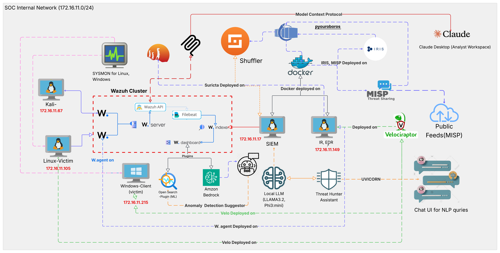

# SocCraft
An AI-enhanced, open-source SOC framework with SOAR capabilities, designed for high-speed, automated incident response.
# SOCCraft: An ML, AI-Augmented, Open-Source SOC with SOAR

**SOCCraft is a complete, end-to-end security framework that reduces incident response time by over 98% compared to manual processes.** It integrates a full open-source security stack with a hybrid AI engine to provide high-speed detection, intelligent analysis, and automated, risk-based remediation.

---

## 🚀 Key Features

- **End-to-End Automation:** A fully automated pipeline from initial file detection to final remediation in under 15 seconds.
- **AI-Gated, Risk-Based Response:** Autonomously executes proportionate actions (**Monitor**, **Quarantine**, or **Delete**) based on the AI-determined risk level.
- **Resilient Hash-Based Detection:** Relies on immutable file hashes, making it effective against evasion techniques like renaming malware.
- **Hybrid AI Model:** Uses a local LLM for privacy-sensitive analysis and a cloud AI for advanced risk assessment.
- **Proactive Anomaly Detection:** Employs unsupervised machine learning (RCF) to detect "unknown unknowns" that signature-based tools would miss.

---

## 🏗️ Architecture

The SOCCraft framework is a multi-layered ecosystem that integrates best-in-class open-source tools.

---

## 🛠️ Technology Stack

- **SIEM/EDR:** Wazuh, OpenSearch, Velociraptor
- **SOAR & Automation:** Shuffle, Custom Python
- **AI & ML:** Amazon Bedrock, Ollama (Llama3), Random Cut Forest
- **Network Security:** Suricata
- **Threat Intelligence:** MISP, VirusTotal
- **Deployment:** Docker, NGINX, QEMU/KVM

---

## 📊 Performance Results

The framework was validated against multiple MITRE ATT&CK scenarios, demonstrating consistent, high-speed performance.

| Threat Scenario | Total Time (s) |
| :--- | :--- |
| SSH Brute Force Attack | 2.700 |
| Malicious File Drop (Critical) | 11.996 |
| Webshell Deployment | 10.221 |
| **Average Total Time** | **12.489** |

---

## 🎬 Demo

*[Insert a GIF here showing the end-to-end Warzone RAT test: file drop -> alerts -> file deleted]*
